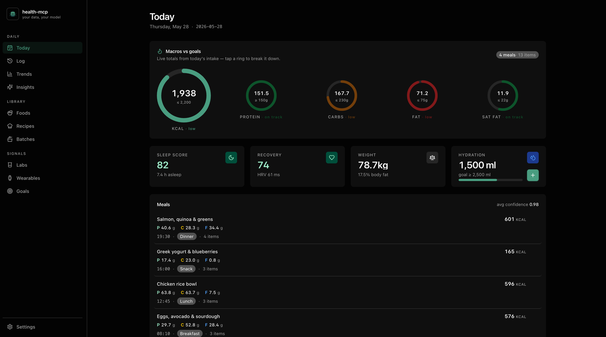
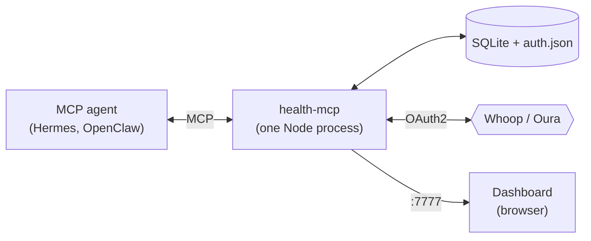

<p align="center">
  
</p>

# health-mcp

> Your personal health database. Your agent does the typing.

A local-first server that stores your nutrition, biomarker, and wearable data. The whole thing is exposed as Model Context Protocol tools, so any MCP-aware agent (Hermes, OpenClaw) can read and write it. A web dashboard ships in the same process for when you want to look at the data instead of talk to it.

Everything runs on your machine. One SQLite file. No accounts, no SaaS, no telemetry.

<p align="center">
  
</p>
<p align="center">
  <sub>The bundled dashboard's <strong>Today</strong> view: macros vs goals, sleep / recovery / weight / hydration, and the day's meals.</sub>
</p>



Instead of building another photo-CV calorie app or a freeform-text parser, you let the agent handle the squishy parts ("I had two eggs and toast", "log this lab PDF", "what affects my sleep score?") and let this server handle the durable parts: typed schema, atomic transactions, range queries, a capability-gated tool surface, and a UI that doesn't lie about the data underneath.

---

## What it tracks

**Nutrition.** Foods (USDA, Open Food Facts, manual entries), meals composed of food / recipe-serving / batch / custom components, hydration, weight, body measurements, macro goals as `{min, max}` bounds, and daily / weekly rollups.

**Recipes and cooked batches.** Recipes scale to per-serving macros. A batch is a cooked instance that depletes as you eat against it, with atomic decrements inside `log_meal` and refunds on delete.

**Remembered meals.** Label your usual breakfast once, relog it in a single tool call. Holds either pre-resolved components (deterministic) or canonical free text (the agent re-estimates on each call).

**Biomarkers and labs.** About 60 curated biomarkers seeded with LOINC codes, default units, and reference + optimal ranges. Lab panels insert atomically with all their results. A three-tier range walk decides each result's status: per-result lab snapshot → per-biomarker default → curated optimal. Unit conversion for the common dual-unit pairs (mg/dL ↔ mmol/L, ng/mL ↔ nmol/L, etc.). Trend and "latest per marker" queries.

**Wearables.** Whoop and Oura over OAuth2 today. Each provider mirror keeps the raw payload (`raw_json` per row) so a future migration can promote any field to a normalized column without re-syncing. Normalized tables (`wearable_sleep`, `wearable_activity`, `wearable_readiness`, `wearable_daily`) let you read across vendors without caring which one is connected. Refresh tokens rotate; concurrent 401s can't double-spend because the auth store is mutex-guarded per provider.

**Insights.** `correlate` runs Pearson or Spearman over any two metric series, bucketed by day / week / month. Signed lag buckets shift one series in time. Forward-fill carries the last value through gaps so sparse lab data correlates cleanly against daily wearable scores. The tool stays hidden in the agent's catalog until there's enough data to be meaningful.

---

## Quick start

### npx

Node ≥ 20, no clone or build:

```bash
npx health-mcp            # http://127.0.0.1:7777, opens the dashboard
npx health-mcp --stdio    # headless MCP server over stdio
```

State lives in `~/.health-mcp/` (one SQLite file). `npx health-mcp --help` lists every flag; `npx health-mcp doctor` runs a self-check.

### Docker

```bash
git clone https://github.com/lukaisailovic/health-mcp.git
cd health-mcp
cp .env.example .env

# Put a strong token in .env (required to bind off-loopback)
openssl rand -hex 32

docker compose up -d
open http://127.0.0.1:7777
```

Data persists in the `health-mcp-data` named volume. If you'd rather see the files on disk, swap the volume mapping in `docker-compose.yml` for `./.health-mcp-data:/data`.

`docker compose down` stops the container; data survives across restarts.

### From source

Node ≥ 20 and pnpm.

```bash
git clone https://github.com/lukaisailovic/health-mcp.git
cd health-mcp
pnpm install
pnpm build
pnpm start                      # http://127.0.0.1:7777, browser opens automatically
```

For development with hot reload on the dashboard, shared types, and the server, run all three in watch mode:

```bash
pnpm dev
# server on :7777, dashboard dev on :5173 (proxies /api/* to :7777)
```

Pass `--no-open` to keep the browser shut, or `--no-dashboard` to run as a headless MCP / REST server.

### Subcommands

```bash
pnpm start -- migrate                  # apply pending DB migrations and exit
pnpm start -- doctor                   # self-check (DB pragmas, file modes, token entropy)
pnpm start -- export /tmp/dump.jsonl   # JSONL dump; raw_json redacted unless --include-raw
pnpm start -- import-usda dump.json    # ingest a USDA FoodData Central bulk JSON
```

---

## Connect an MCP agent

### Hermes / OpenClaw (stdio)

Both use the standard MCP config, so the setup is identical: add health-mcp to the agent's `mcpServers`. No clone or build needed; point it at the published package:

```json
{
  "mcpServers": {
    "health": {
      "command": "npx",
      "args": ["-y", "health-mcp", "--stdio"]
    }
  }
}
```

Where that block lives differs by agent; check its MCP settings for the path.

Then ask your agent:

- *"Log eggs and toast for breakfast"* → `log_meal`
- *"How's my fasting glucose trending?"* → `biomarker_trend`
- *"Does my protein intake correlate with Whoop recovery the next day?"* → `correlate` with `lag_buckets: 1`

Running from a local checkout instead? Use `"command": "node"` with `"args": ["/path/to/health-mcp/apps/server/dist/index.js", "--stdio"]` after `pnpm build`, or `"args": ["--import", "tsx", "/path/to/health-mcp/apps/server/src/index.ts", "--stdio"]` to skip the build.

### MCP Inspector

```bash
cd apps/server
pnpm inspect
```

Opens the MCP Inspector against a stdio child for poking at tools by hand.

### HTTP / custom client

The Streamable-HTTP transport is mounted at `POST /mcp` on the same port as the dashboard. Point any HTTP-aware MCP client at `http://127.0.0.1:7777/mcp` and send `Authorization: Bearer <HEALTH_MCP_TOKEN>` when a token is set.

The first OAuth link to a wearable provider needs the HTTP server running so the callback route can receive the redirect. Once linked, refresh tokens persist in `auth.json` and stdio mode can sync from there indefinitely.

---

## The dashboard

Served at `/` from the same process. Pages today:

- **Today** — meals for the day, totals against goals, hydration, weight
- **Log** — add meals, hydration, weight, body measurements
- **Foods**, **Recipes**, **Batches** — the food graph
- **Goals** — macro bounds, weight target
- **Labs** — panels, results, trends, per-biomarker About card
- **Trends** — weekly rollups
- **Wearables** — provider status, sleep / activity / readiness / daily reads
- **Insights** — `correlate` UI
- **Settings** — token, timezone, theme

Built on TanStack Router + Query, Kumo UI over Tailwind v4, and Recharts. Dark mode follows your OS by default; you can pin it in Settings.

---

## Configuration

Precedence: CLI flag > env var > JSON config file > default.

| Env var | Purpose | Default |
|---|---|---|
| `HEALTH_MCP_TOKEN` | Bearer token. Required to bind off-loopback. | unset (loopback-only) |
| `HEALTH_MCP_PORT` | HTTP port | `7777` |
| `HEALTH_MCP_HOST` | Bind host | `127.0.0.1` |
| `HEALTH_MCP_DATA_DIR` | Storage dir for `data.db` and `auth.json` | `~/.health-mcp` |
| `HEALTH_MCP_TZ` | IANA timezone for day-bucket queries | system TZ |
| `HEALTH_MCP_WHOOP_CLIENT_ID` / `_SECRET` | Whoop OAuth app credentials | — |
| `HEALTH_MCP_OURA_CLIENT_ID` / `_SECRET` | Oura OAuth app credentials | — |
| `HEALTH_MCP_USDA_API_KEY` | Enables USDA FoodData Central remote search | local search only |
| `HEALTH_MCP_DASHBOARD` | Serve the dashboard at `/` | `true` |
| `HEALTH_MCP_LOG_LEVEL` | `debug` / `info` / `warn` / `error` | `info` |

Every flag, every env var, the JSON config-file schema, and the security invariants enforced at startup are in [docs/CONFIGURATION.md](./docs/CONFIGURATION.md).

---

## Privacy and security

The server is built to fail closed.

- Loopback is the only safe default. To bind anywhere else you must set `HEALTH_MCP_TOKEN` to a 32+ character high-entropy string (`openssl rand -hex 32`); the server refuses to start otherwise, with no soft fallback.
- `data.db` and `auth.json` are created `0600` inside a `0700` parent. Looser modes refuse to open unless you pass `--allow-insecure-db` / `--allow-insecure-auth`.
- Wearable OAuth credentials live in `~/.health-mcp/auth.json`, separate from `data.db`, so `health-mcp export` can ship the database without leaking provider tokens.
- Providers like Whoop rotate refresh tokens on every use. The auth store serializes refresh per provider so two concurrent 401s can't both spend the same token and lock you out.
- The OAuth callback uses an HMAC-signed state payload with a 10-minute expiry and a single-use nonce persisted in SQLite. No replay, no forgery.

What this protects against, what it doesn't, and how to safely expose the server beyond localhost (TLS-terminating tunnel; check the doctor output) are covered in [docs/SECURITY.md](./docs/SECURITY.md).

---

## How it's put together

One Node process. A Hono app mounts the MCP Streamable-HTTP transport at `/mcp`, the REST mirror at `/api/*`, the wearable OAuth callback at `/auth/wearable/callback`, and the dashboard SPA at `/`. Storage is SQLite via better-sqlite3 with `journal_mode=WAL` and `foreign_keys=ON`. All business logic lives in `apps/server/src/services/*.ts`; MCP tool handlers and REST routes are thin Zod-validated wrappers that delegate. Wearable data flows through a `WearableProvider` interface that writes raw per-vendor mirrors and normalized cross-vendor tables in one transaction per sync page.

In HTTP mode a cron job (`*/30 * * * *` by default, configurable) calls `syncWearables()` for every linked provider. Stdio mode skips the scheduler; agents call `sync_wearables` on demand.

The service-by-service breakdown, transport plumbing, and capability-gating mechanics are in [docs/ARCHITECTURE.md](./docs/ARCHITECTURE.md).

---

## Tools surface

About 60 tools. `discover_capabilities` returns the live catalog grouped by area, with the current enable flag, so agents can call it first instead of guessing what's available.

<details>
<summary>Show all tool names</summary>

```
ping, discover_capabilities

# food
search_food, search_foods, lookup_barcode, get_food
create_custom_food, update_custom_food, delete_custom_food

# meals
log_meal, list_meals, get_meal, update_meal, delete_meal, undo_last_meal,
add_meal_component, update_meal_component, remove_meal_component

# recipes + batches
create_recipe, update_recipe, delete_recipe, list_recipes, get_recipe
create_batch, list_batches, get_batch, archive_batch, delete_batch

# remembered meals  (read tools hidden until you save one)
remember_meal, list_remembered_meals, get_remembered_meal,
update_remembered_meal, forget_meal, log_remembered_meal

# simple logs
log_hydration, list_hydration, delete_hydration
log_weight,    list_weight,    delete_weight
log_measurement, list_measurements, delete_measurement
get_goals, set_goals

# summaries
daily_summary, weekly_summary, range_summary

# biomarkers + labs
search_biomarker, get_biomarker, create_custom_biomarker, update_biomarker, set_optimal_range
log_lab_panel, log_lab_result, list_lab_results, latest_biomarkers, biomarker_trend
list_lab_panels, get_lab_panel, delete_lab_result, delete_lab_panel

# insights  (hidden until ≥7 days intake AND (≥1 wearable_daily row OR ≥3 lab_results))
correlate, list_correlate_metrics

# wearables  (most hidden until a provider is linked)
wearables_list_providers, wearables_status,
wearable_connect_url, wearable_disconnect, sync_wearables,
wearable_sleep, wearable_activity, wearable_readiness, wearable_daily, wearable_metric_minutes,
set_activity_type_map

# whoop  (hidden until linked)
whoop_recovery, whoop_cycles, whoop_sleep_raw, whoop_workouts_raw,
whoop_profile, whoop_body_measurement
```

</details>

Capability gating hides tools the agent can't currently use, so the surface stays small. Wearable reads stay invisible until a provider is linked; `correlate` stays invisible until there's data worth correlating. The full catalog with parameters, return shapes, and gating rules is in [docs/MCP.md](./docs/MCP.md).

---

## Documentation

| Doc | What it covers |
|---|---|
| [Architecture](./docs/ARCHITECTURE.md) | Process layout, transports, service layer, scheduler |
| [Configuration](./docs/CONFIGURATION.md) | Flags, env vars, JSON config, subcommands, startup invariants |
| [MCP tools](./docs/MCP.md) | Tool catalog, capability gates, item shapes, agent-client wiring |
| [REST API](./docs/API.md) | `/api/*` mirror used by the dashboard |
| [Data model](./docs/DATA_MODEL.md) | SQLite schema, indexes, raw-vs-normalized wearable split |
| [Biomarkers](./docs/BIOMARKERS.md) | Three-tier range model, status walk, unit-conversion table |
| [Wearables](./docs/WEARABLES.md) | Provider interface, OAuth flow, refresh rotation, provider matrix |
| [Security](./docs/SECURITY.md) | Bearer auth, loopback rule, file modes, OAuth state, threat model |

---

## Contributing

Issues and PRs welcome.

```bash
pnpm install
pnpm typecheck && pnpm lint && pnpm test
```

A few ground rules:

- Business logic lives in `apps/server/src/services/`. MCP tools (`src/mcp/tools/`) and REST routes (`src/rest/`) are thin wrappers around it. Don't put logic in handlers.
- Migrations are checked-in TypeScript modules under `apps/server/src/db/sql/000N-*.ts`. Forward-only.
- Shared Zod schemas live in `packages/shared`. The server and dashboard agree there.
- New services want a Vitest case (`*.test.ts`) or coverage through the integration suite (`apps/server/src/integration.test.ts`).
- `pnpm lint:fix` before pushing — Biome.

Adding a new wearable provider is a self-contained job: create `apps/server/src/wearables/providers/<id>/`, add a migration with the raw mirror tables, register in the wearable registry. The normalized read tools pick it up automatically. Walkthrough in [docs/WEARABLES.md](./docs/WEARABLES.md#adding-a-new-provider).

---

## Status

Solo project, actively developed. The data model is stable for nutrition, biomarkers, and Whoop / Oura sync; migrations are forward-only and run on boot. Expect breaking changes to tool parameters and dashboard routes until a `1.0` tag. File an issue if something stops you cold.

This is a personal-use tool, not medical advice or a medical device. The values, ranges, and correlations it surfaces are for self-quantification, not diagnosis.

---

## Tech

Node ≥ 20 · pnpm · TypeScript (ESM, strict) · Hono · `@modelcontextprotocol/sdk` v1 · better-sqlite3 · Zod · croner · Vitest · Biome.

Dashboard: Vite · React 18 · TanStack Router + Query · Tailwind v4 · Kumo UI · Recharts.

---

## License

[MIT](./LICENSE).
